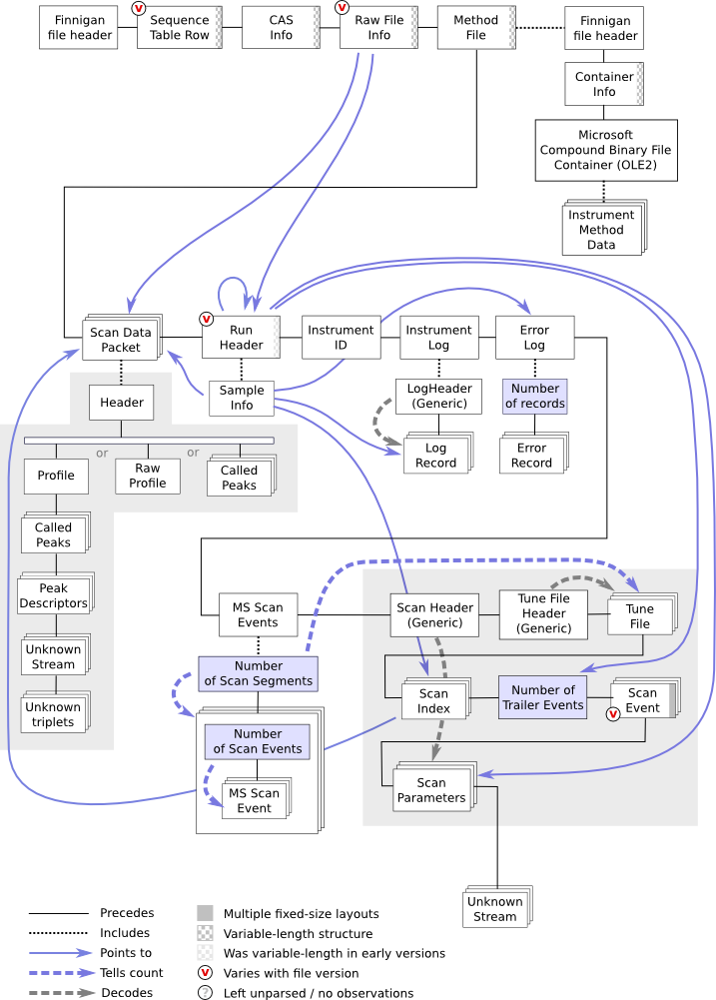

# unfinnigan

Written by Gene Selkov Jr.

Code for painless extraction of mass spectra from Thermo "raw" files (Perl decoders plus Python utilities).

The original Google Code wiki text and images were recovered from the Internet Archive and is now available on GitHub Pages: https://csdaw.github.io/unfinnigan/

## Thermo Raw File Structure (v63) 

Note: the latest files are (I believe) v66 so this is likely out of date, but still relevant.

