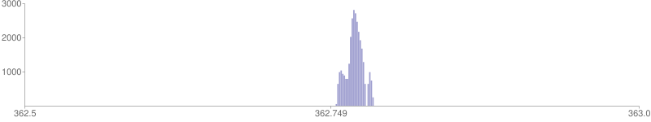
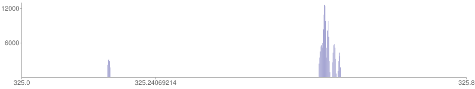

Two general kinds of problems may require further research

- The meaning of some data elements remains unknown, or, conversely, we don't know the precise location of certain elements we know must exist.
- It is certain that some kinds of data expected to exist in a Finnigan file do not actually exist; instead they are calculated based on the existing data.

It is difficult to list all possible problems; this list will grow or shrink as new problems emerge and old ones get solved.

## Known value, unknown location

Example: **activation method**

Only a few out of close to 90 items possibly contained in [ScanEventPreamble](../structures/ScanEventPreamble.md) have been identified. This data structure is a byte array containing binary flags and byte-size attributes (enums) describing scan event types and instances. For example, I suspect that the **activation method** element is hidden somewhere in [ScanEventPreamble](../structures/ScanEventPreamble.md); however, I have not seen enough variation in the data files to pinpoint its location and to identify all of its possible values. All data files I have seen so far were recorded using CID (Collision-Induced Dissociation).

The present work-around for not knowing this element's location is to enter it on the command line where it is required or expected. Presently, it is only important when running Finnigan-to-mzXML conversions with [uf-mzxml](../tools/UnfinniganMzXML.md).

- I realise that mzXML is a retired format, but I use the mzXML files generated by [readw](http://tools.proteomecenter.org/wiki/index.php?title=Software:ReAdW) as a reference while testing the validity of my decoder. So far, the unknown location of the **activation method** value causes the only major discrepancy (the minor ones being differences in the floating-point format).

## Known to be absent

Example: **precursor intensity**

The mzXML format specifies the element `<precursorMz>` in dependent scans, containing the data about the precursor ion, including **precursor intensity**. In one example, it looks like this:

```
<precursorMz precursorIntensity="2819.49" precursorCharge="2" activationMethod="CID" >362.7492981</precursorMz>
```

This corresponds to the MS2 scan number 351 in `20070522_NH_Orbi2_HelaEpo_05.RAW` from Matthias Mann's lab. The file was converted with [readw](http://tools.proteomecenter.org/wiki/index.php?title=Software:ReAdW).

It is curious that while the precursor *M/z* and its charge (and presumably, the activation method as well) are simply copied from the scan data, there is no unassigned floating-point element that could possibly store **precursor intensity**. It is clear that the creators of the Finnigan data format did not consider precursor intensity to be important enough to include it in the MS2 scan data. It had to be retrofitted by later applications.

The value `2819.49` only occurs once in the entire file: it happens to be the intensity of one of the profile bins in the parent scan number 350:



To be precise, it is the maximum intensity in the group of peaks nearest to, but not including, the stated precursor *M/z* of 362.749. The *M/z* of the maximum is 362.7676 and nearest non-zero bin is 362.7532. Apparently, either [readw](http://tools.proteomecenter.org/wiki/index.php?title=Software:ReAdW) itself or the proprietary library it uses to decode the file carried out a search in the parent profile to find a suitable measure of **precursor intensity**.

- Is this a valid approach?

- What can be the reason for such a discrepancy between the *M/z* value in dependent scans and the value recorded in the parent scan profile? (It is not always as large; sometimes it falls within a single peak, only a few bins away from its maximum value, but often it is as large as the difference shown in this example)

- How significant is this discrepancy?

- How far is too far?

I can attempt to answer the last question by observing how **[readw](http://tools.proteomecenter.org/wiki/index.php?title=Software:ReAdW)** treats such cases. In the following example, the distance between the precursor *M/z* (325.24) and the nearest MS1 peak is about 48 Hz:



That is too far for [readw](http://tools.proteomecenter.org/wiki/index.php?title=Software:ReAdW), and it bails out of search, setting **precursorIntensity** to 0. It seems to bail out everywhere it can't find a peak within 25 Hz of the stated value, but I do not know what the exact threshold is. It may be lower than that.

However, it seems to want to go for isotopes where the base peak cannot be found, and if it hits a lighter isotope one atomic unit away form the target, it treats that as a precursor peak. See [the bottom of this page](../tools/UnfinniganMzXML.md) for an example.

## File structure

- **Method file detection**: There are just two things in the structures preceding the [MethodFile](../structures/MethodFile.md) that may be used ot indicate whether or not it is present. One unknown object, `/file header/unknown long[5]`, varies from file to file, and it is possible that one of its bits is an indicator, but I do not have enough data to prove or disprove that. The values of the first long in `/raw file info/preamble` do correlate with the presence of absence of the [MethodFile](../structures/MethodFile.md) in the dozen files that I have tested, but that is probably not a large enough number of cases to be sure. So for now the operational definition of the [MethodFile](../structures/MethodFile.md) structure is *"something that occurs between [RawFileInfo](../structures/RawFileInfo.md) and the start of the data stream"*. In other words, if the file pointer arrives at the start of the data stream after [RawFileInfo](../structures/RawFileInfo.md) has been read, there is no [MethodFile](../structures/MethodFile.md).
